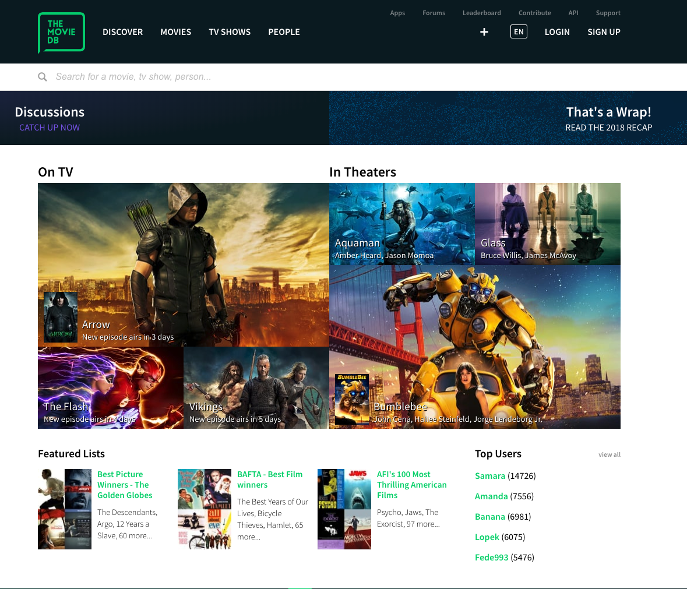
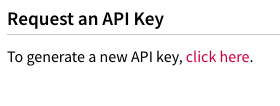

## User Stories

1. **User can see recent movies from TheMovieDB**
    1. **Set up a feature branch**
    1. **Integrate with The MovieDB API**
    1. **Update the root route and view to show recent movies**
    1. **Call the MovieDB API**
1. User can see one Movie, including the poster and trailer
1. User reviews are associated with the corresponding movie
1. Users can add or delete comments without requiring a page refresh
1. Users can access an admin dashboard that lists all reviews and allows them to delete them

You should already have a Git repo set up from the first Rotten Potatoes tutorial. We're going to build off of that code for this one, so no need to set up a new repo. Instead, we're going to build a **feature branch** for the repo!

## New GitHub Feature Branch

Git is for **versioning** your code so you can **revert** to older versions if you screw up. And it is for **sharing** code and **collaborating** with other developers. In order to do both of these better, Git offers a feature called **branches**. A branch is a _separate version of your code base that is different from other branches_.

So far you have always been coding on the **master** branch, but for this tutorial we are going to practice using named **feature branches** to keep our features _separate from master_. Once we are done with our feature, we will **merge** the feature branch into the master branch, and then we can push master to GitHub and production. **This is an [industry-standard](https://www.atlassian.com/git/tutorials/comparing-workflows/feature-branch-workflow) for building features for a production use case.**

We want to add a feature to group reviews by movie in our app, so let's make a feature branch called `movies`. We'll use the `get checkout -b BRANCH-NAME` command to make a new branch, and then `git branch` to see our branches.

>[action]
> Make the `movies` branch
>
```bash
$ git checkout -b movies
$ git branch
```

After running `git branch`, you should see you are in a new branch called `movies`. You can hit `q` to exit out of the branch view.

# The MovieDB

We're going to use [The MovieDB](https://www.themoviedb.org/) to search and view recent + popular movies.



>[info]
> It will be important to read the [MovieDB API docs](https://developers.themoviedb.org/3/getting-started/introduction) going forward so that we know how to interact with the API through our web app.

<!-- -->

>[action]
> Follow the steps below so that you can obtain an API Key to use in your web app
>
> 1. [Create an account] (https://www.themoviedb.org/account/signup)
> 1. Verify your account through the email you receive
> 1. Navigate to your [API Settings](https://www.themoviedb.org/settings/api)
> 1. Under **Request an API Key**, you'll find a link to create a new API key
> 
> 1. Select **Developer** when asked which type of API key you want to register
> 1. Agree to the Terms of Use (you always read the whole thing, right?)
> 1. Fill out the form with the appropriate information. Provide a _unique name_ in the **Application Name** section. In **Application URL** just put **N/A**, and in your **Application Summary** put **Building a website and using your API only for educational purposes. Thanks!**

Congrats, you just got your own MovieDB API Key! We'll be using the **API Key (v3 auth)** key for our tutorial, so make sure you can easily access it when we use it later.

# Movies Resource

We are going to create a **Movie** resource, but it won't have a model or a collection in our database, because the movies all live inside The MovieDB, but we will have a `movies.js` controller to house the Movie resource routes. Because we cant CREATE or UPDATE information in the MovieDB, we'll only need two movies routes `index` and `show`:


| URL              | HTTP Verb | Action  | What it Does |
|------------------|-----------|---------|---------------|
| /movies          | GET       | index   | See all movies |
| /movies/:id      | GET       | show    | See one movie |

>[action]
> Create a `controllers/movies.js` file and add it to your `app.js` with a `require()` statement like you added `reviews.js` and `comments.js`:
>
```js
...
// Require the models and controllers
const reviews = require('./controllers/reviews')(app);
const comments = require('./controllers/comments')(app);
[bold]const movies = require('./controllers/movies')(app);[/bold]
...
```

# Updating Root Route

When you go to Rotten Tomatoes, you don't view by review, you view by movie and then look at the review, right? We should do that too in our app!

>[action]
>
> 1. Let's comment out the Index `/` route in `reviews.js`
> 1. Add a root route to our `movies.js` file:
>
```js
// movies.js
>
module.exports = function(app) {
>
  app.get('/', (req, res) => {
    res.render('movies-index');
  });  
>
}
```

Hold up, we need to make a `movies-index` to look at!

>[action]
> Create `/views/movies-index.handlebars` with a basic template:
>
```html
<h1>Hello Movies</h1>
```

Turn on `nodemon` if you haven't already, and then head over to your browser and check that your root route is now showing this `h1` tag.

# Calling our API

Now let's call the API.

A quick search of [npmjs.org](https://www.npmjs.com/package/moviedb-promise) reveals that there is a wrapper for the MovieDB API! Let's use it to simplify how we call the movieDB API.

>[action]
> Install the moviedb-promise dependency:
>
```bash
$ npm install moviedb-promise --save
```

Now let's add it to our `movies.js` controller and then use it to request movies that are now playing.  Make sure to put in your API key into the initialization before calling any queries or you can bet it will throw an error saying that there is no valid API key.

>[action]
> Replace your `controllers/movies.js` code with the following. Make sure to **replace** `YOUR_API_KEY` with your actual API key.
>
```js
// movies.js
>
module.exports = function (app) {
>
    const MovieDb = require('moviedb-promise')
    const moviedb = new MovieDb('a83edce1e248c89c1a447f67bc7dcf0b')
>
    app.get('/', (req, res) => {
        moviedb.miscNowPlayingMovies().then(response => {
            res.render('movies-index', { movies: response.results });
        }).catch(console.error)
    })
>
}
```

We used the `miscNowPlayingMovies()` method, but you can use any you find in the [moviedb-promise docs](https://www.npmjs.com/package/moviedb-promise) and the [Movies section of the MovieDB API docs](https://developers.themoviedb.org/3/movies/get-movie-details). Play around with a sample request with their awesome API method docs and playground. Access the playground from the **Try it out** tab you see on any meod doc page.


And now we need to show the list of results in the template.

>[action]
> Update your `/views/movies-index` template to the following:
>
```html
<h1>Now Playing</h1>
{{#each movies}}
  <li>{{this.title}}</li>
{{/each}}
```

You should now see a list of currently playing movies on your browser!

>[action]
> Read the [Now Playing docs](https://developers.themoviedb.org/3/movies/get-now-playing) and look at the `Responses` section to see an example of the JSON that gets returned for each movie. See how we used the `title` property in our template?


A list is ok, but we can do better than this. Did you notice there's a `poster_path` in the returned object? Instead of just displaying titles, let's make a thumbnail that displays the title and the poster!

The thumbnail should be an `<a>` tag so it is clickable link to `/movies/:id` where the `:id` is the id provided from the API. We'll build out this route in the next chapter, so don't worry about it not working for now.

>[action]
> First check out the [Configuration method](https://developers.themoviedb.org/3/configuration/get-api-configuration). We'll be using the sample image URL structure they provide in this tutorial. Go to the **Try it out** section, provide your API key and look at the responses for **poster_sizes**. Pick one of the smaller ones. We're going to use `w154` for this tutorial.
>
> Now update `/views/movie-index` to the following. Notice how we're constructing the `href` of the `<a>` and the `src` of the `` :
>
```html
<h1>Now Playing</h1>
<div class="row">
    {{#each movies}}
        <div class="card">
            <div class="col-md-3 card-body">
                <h2 class="card-title">{{this.title}}</h2>
                <a href="/movies/{{this.id}}"></a>
            </div>
        </div>
    {{/each}}
</div>
```

Refresh your browser and check out those sweet sweet posters!

Great work here! You've successfully begun the process of **using a GitHub Feature Branch strategy to refactor a project**, and started down the path of **integrating an external API to add a new resource!**

# Now Commit

Note that we need to make sure to set the upstream branch when we push for the first time:

>[action]
>
```bash
$ git add .
$ git commit -m 'Users can see movies currently playing'
$ git push --set-upstream origin movies
```

# Stretch Challenges

>[challenge]
>
>1. Can you also request the [Movie Genres](https://developers.themoviedb.org/3/genres/get-movie-list) from the API, then map the genres into the movie's genres and display them in the thumbnail under the title? Remember to check out the [moviedb-promise](https://www.npmjs.com/package/moviedb-promise) documentation.
> 1. Can you think of a better way to get the `src` on the `img` so we aren't reliant on static urls? Can we use the [Configuration method](https://developers.themoviedb.org/3/configuration/get-api-configuration) to always make sure we have the correct url?
